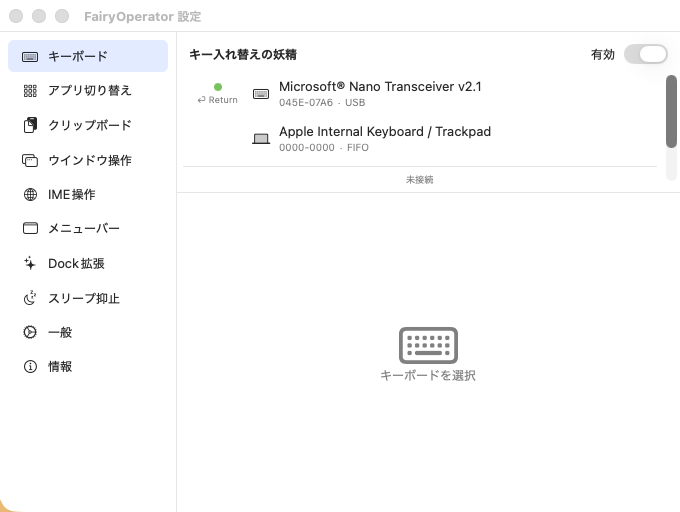

<div align="center">
  
  <h1>FairyOperator</h1>
  <p>macOS の入力・ウインドウ・Dock を、妖精が手伝ってくれる。</p>
  <p>
    <a href="https://github.com/piggest/FairyOperator-releases/releases/latest"></a>
    <a href="https://piggest.github.io/FairyOperator-releases/"></a>
    
  </p>
</div>

---

## 概要

FairyOperator は macOS 上の操作を快適にするユーティリティ集。それぞれの機能を「妖精」と呼び、必要なものだけを有効化して使う。

- **キー入れ替えの妖精** — 外付けキーボードごとにキーを再マッピング
- **アプリ切り替えの妖精** — Cmd+Tab を強化、Unity プロジェクトのアイコン自動探索
- **クリップボードの妖精** — 履歴の保持と検索
- **ウインドウ操作の妖精** — ホットキーで配置・最大化
- **IME 操作の妖精** — 日本語入力のオン/オフ制御
- **メニューバーの妖精** — ステータスバーから素早く操作
- **Dock 拡張の妖精** — Dock アイコンに追加情報をオーバーレイ
- **スリープ抑止の妖精** — 必要なときだけスリープを抑止

## ダウンロード

最新版は [Releases](https://github.com/piggest/FairyOperator-releases/releases/latest) から `.dmg` または `.app.zip` を取得。

```
# .app.zip をダウンロード後
unzip FairyOperator.app.zip -d /Applications/
xattr -dr com.apple.quarantine /Applications/FairyOperator.app
open /Applications/FairyOperator.app
```

> Developer ID 署名 + Apple Notarization 済み。Gatekeeper 警告は出ない想定。

## スクリーンショット

<div align="center">
  
</div>

## 必要環境

- macOS 13 (Ventura) 以降
- アクセシビリティ権限（キー入れ替え・ウインドウ操作・Dock 拡張で使用）
- 入力モニタリング権限（キー入れ替えで使用）

## ライセンス

本リポジトリはバイナリ配布とランディングページの公開を目的とする。ソースコードは別管理。

## 関連リンク

- [ランディングページ](https://piggest.github.io/FairyOperator-releases/)
- [Releases](https://github.com/piggest/FairyOperator-releases/releases)
- [Issues](https://github.com/piggest/FairyOperator-releases/issues)
